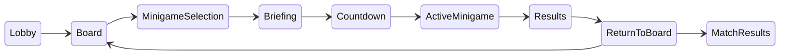
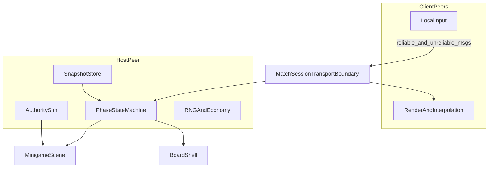
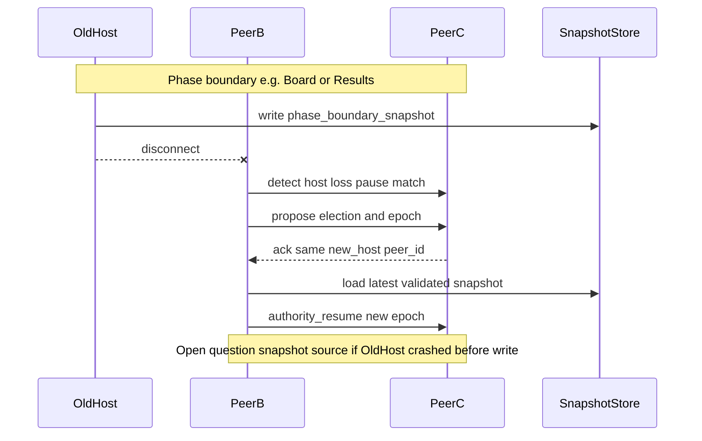

# Networking architecture

This guide describes the proposed online architecture for Bean Party. It is implementation guidance for a future networking spike, not production netcode. Class and API names are **proposals** until code lands.

Related documents:

- [Decision 0003: peer-hosted networking](../decisions/0003-peer-hosted-networking.md) — chosen baseline and validation gates
- [Networking implementation plan](../plans/networking.md) — milestones and test matrix
- [Minigame integration contract](minigame-integration.md) — network-facing minigame inputs, outputs, and sync profiles

## Terminology

| Term | Meaning |
| --- | --- |
| **Network peer** | One connected machine or household (`peer_id` from Godot multiplayer) |
| **PlayerSlot** | Logical in-match player identity; stable across phases; may be local to one peer |
| **Host / authority** | The peer that owns canonical match state and validates client intentions |
| **Phase-boundary snapshot** | Serialized recoverable state stored only at safe match phases |
| **Session layer** | Proposed boundary between gameplay and the concrete `MultiplayerPeer` |
| **Sync profile** | Minigame-declared networking behavior: `TURN_OR_EVENT`, `HOST_SNAPSHOT`, `HOST_ACTION`, `CUSTOM_APPROVED` |
| **match_epoch** | Proposed monotonic counter bumped when authority or snapshot generation changes |

### Status labels

- **Architectural direction** — recommended baseline to implement toward
- **Spike assumption** — default for the first ENet spike; may change after measurement
- **Open question** — must be answered by a milestone before treating behavior as final
- **Deferred** — intentionally out of the first networking vertical slice

## Match topology

**Architectural direction:** a match has exactly one **authority process** (today: the host peer in listen-server configuration) and zero or more **client peers**, with **up to 4 `PlayerSlot`s** total across all peers.

Distinguish three concepts that must not be conflated in gameplay code:

| Concept | Meaning | v1 notes |
| --- | --- | --- |
| **Authority process** | Owns canonical simulation, hits, scoring, RNG | Runs on the host peer today; **must not assume** the authority always controls a `PlayerSlot` |
| **Network peer** | One connected machine (`peer_id`) | May own zero or more `PlayerSlot`s |
| **Logical `PlayerSlot`** | In-match player identity | Submits inputs through its owning peer |

**Architectural direction:** gameplay systems query authority through the session layer, not through “am I player 1?” checks alone. This preserves a future path to a headless dedicated authority without rewriting minigames. Dedicated servers are **deferred**; the separation is a design constraint now.

Proposed capacity constants:

| Constant | Value | Notes |
| --- | --- | --- |
| `MAX_PLAYERS` | 4 | Logical `PlayerSlot` hard cap |
| `MAX_PEERS` | TBD by spike | Bounded by ENet/Steam connection limits; likely ≤ 4 for friend sessions |

Example layouts:

- **4 remote friends** — 4 peers × 1 `PlayerSlot` each
- **Couch + online** — 2 peers × 2 local `PlayerSlot`s each
- **Local-only (no network)** — 1 peer × up to 4 `PlayerSlot`s (offline milestone 1)

```text
                    ┌──────────────── Host peer (authority) ────────────────┐
                    │  PlayerSlot A (local)   PlayerSlot B (local, couch) │
                    └───────────────┬─────────────────────────────────────┘
                                    │ reliable + unreliable messages
          ┌─────────────────────────┼─────────────────────────┐
          ▼                         ▼                         ▼
   Client peer 2              Client peer 3              Client peer 4
   PlayerSlot C               PlayerSlot D               PlayerSlot E, F
```

A **network peer** represents a connection endpoint. A **`PlayerSlot`** represents who is playing in the match. Multiple `PlayerSlot`s may share one `owning_peer_id` when one computer runs several local controllers.

### Proposed `PlayerSlot` schema

Documentation only—not a requirement to implement this GDScript class yet.

```text
player_id:            stable match-scoped ID (e.g. UUID)
owning_peer_id:       int — network peer that submits inputs for this slot
local_player_index:   int — stable 0..N-1 index for this slot on the owning peer (replicated)
display_name:         string
team_id:              optional int or string
character_id:         optional resource ID or cosmetic bundle ref
ready:                bool — briefing / lobby readiness
connection_status:    connected | disconnected | migrating | inactive
```

**Architectural direction:** `local_player_index` is the only couch identity replicated across the network. The mapping from `local_player_index` to physical controller/device (`local_device_slot`) stays **local to the owning peer** and is never replicated.

**Spike assumption:** `player_id` is assigned at lobby join and never reused within a match even if the player reconnects (reconnect binds to the same `player_id`).

## Authority boundaries

Exactly one network peer is authoritative at all times (**architectural direction**). There is no distributed consensus in v1.

### Host owns (authoritative)

| Domain | Examples |
| --- | --- |
| Canonical match state | Active phase, turn order, match timer |
| Board state | Positions, routes taken, tiles, items on board |
| Phase transitions | Lobby → board → minigame → results |
| RNG | Seeds and consequential random outcomes (minigame pick, board events) |
| Match economy | Beans, board resources, rewards applied to `PlayerSlot`s |
| Minigame lifecycle | Start tick/time, end time, forced teardown |
| Minigame simulation | Physics, hit detection, scoring logic (for network-capable minigames) |
| Results | Placements, score breakdown, board rewards |

### Clients may submit (non-authoritative intentions)

| Domain | Examples |
| --- | --- |
| Lobby / briefing | Ready toggles, cosmetic choices within allowed sets |
| Board | Move intent, route choice, spend-resource request |
| Minigame | Timestamped or tick-numbered input frames per local `PlayerSlot` |
| UI | Menu navigation that does not alter authoritative state |

### Clients must not authoritatively

- Assign themselves board positions, items, or economy
- Declare minigame wins, placements, or rewards
- Advance match phase
- Reseed RNG or override host simulation results
- Claim another peer's `PlayerSlot` or exceed `MAX_PLAYERS`

The host validates every client request. Malformed or conflicting requests are rejected; repeated abuse may mark the slot `inactive` (**open question:** kick/ban policy).

## Match phase state machine

**Architectural direction:** the shell drives a host-authoritative phase machine. Clients display phase UI and submit intentions; only the host commits transitions.

| Phase | Purpose |
| --- | --- |
| `Lobby` | Peers connect; `PlayerSlot`s assigned; match settings |
| `Board` | Turn-based or event-based board play |
| `MinigameSelection` | Host selects or RNG picks the next minigame |
| `Briefing` | Rules and ready gate |
| `Countdown` | Short synchronized start window |
| `ActiveMinigame` | Authoritative minigame simulation |
| `Results` | Placements, rewards presentation |
| `ReturnToBoard` | Apply rewards; decide match continuation |
| `MatchResults` | Final standings; return to menu or rematch |



All transitions are **host-authoritative**. Clients receive phase updates via reliable ordered messages.

### Phase-boundary snapshots

**Architectural direction:** snapshots are captured only at **safe phase boundaries** where interrupting and resuming is well defined.

| Capture after entering | Minimum snapshot contents |
| --- | --- |
| `Lobby` (match start) | All `PlayerSlot`s, settings, `match_epoch`, RNG seed |
| `Board` | Board layout, economy, turn state, `PlayerSlot` statuses |
| `Briefing` | Selected minigame id, teams, `PlayerSlot` readiness baseline |
| `Results` | Minigame outcome applied flag, pending board rewards |
| `ReturnToBoard` | Economy after reward application |
| `MatchResults` | Final scores (for rematch / stats) |

Each snapshot should include: `match_epoch`, phase name, RNG stream position, and a hash-friendly canonical serialization for automated consistency checks.

**Spike assumption:** the host writes snapshots; clients keep the last acknowledged copy for reconnect comparison.

**Open question:** snapshot schema versioning and migration across engine iterations.

Do **not** capture mid-`ActiveMinigame` snapshots for recovery in v1—without host migration, host loss during a minigame ends the session (see disconnect policy). After milestone 13, host loss mid-minigame may restore the last boundary and replay the round.

## Message categories

Use Godot's [MultiplayerAPI](https://docs.godotengine.org/en/4.7/classes/class_multiplayerapi.html) RPC modes and channels. Exact RPC names are **proposals**; categories are **architectural direction**.

| Category | Delivery | Use for | Examples |
| --- | --- | --- | --- |
| **Reliable ordered** | `rpc` reliable | State whose **side effects** must not double-apply | Lobby ready, board move accepted, phase change, RNG outcome, minigame results, snapshot epoch |
| **Unreliable ordered state** | `rpc` unreliable | Frequent sim state; newer replaces older | Entity transforms, velocity, animation phase, periodic minigame state |
| **Unreliable cosmetic** | `rpc` unreliable, drop OK | Non-gameplay feedback | One-shot VFX/SFX triggers, emotes, non-scoring particles |

Representative mapping:

| Event | Category |
| --- | --- |
| Board action request (client → host) | Reliable ordered |
| Board action applied (host → all) | Reliable ordered |
| Readiness toggle | Reliable ordered |
| Input frame (client → host) | Unreliable ordered (re-send recent frames if needed) |
| Movement / physics snapshot (host → clients) | Unreliable ordered state |
| Scoring intermediate (host → clients) | Reliable ordered when it affects standings |
| Final results | Reliable ordered |
| Cosmetic bump sparkle | Unreliable cosmetic |

### Reliable side effects and idempotency

Godot reliable ordered RPCs provide **reliable ordered transport while a connection remains valid**, but do **not** guarantee application-level exactly-once effects across reconnects, retries, or authority changes. **Architectural direction:** the host must treat reliable messages that change state as idempotent using application-level keys:

| Idempotency key (proposal) | Used for |
| --- | --- |
| `command_id` | Client board/move requests, lobby actions |
| `minigame_instance_id` | One run of briefing → results for a selected minigame |
| `result_id` | Final minigame placement/score payload |
| `reward_application_id` | Board economy updates on `ReturnToBoard` |

The host keeps a bounded **processed-operation** set (or per-category high-water marks) and ignores duplicates. Tests should prove double-delivery does not double-apply rewards or results.

### Spike defaults (not permanent requirements)

| Parameter | Starting range to validate | Label |
| --- | --- | --- |
| Host simulation rate | 30 or 60 Hz depending on minigame | **Spike assumption** |
| State snapshots to clients | ~10–20 per second for `HOST_SNAPSHOT` minigames | **Spike assumption** |
| Local render rate | 60 Hz (decoupled from sim) | **Spike assumption** |
| Input send rate | Match local sampling up to sim rate | **Spike assumption** |

Measure and revise in milestones 7–8. Do not lock packet sizes or rates in this document.

## Real-time behavior

### Input pipeline (**architectural direction**)

1. Each owning peer samples local input per `PlayerSlot`, mapping `local_player_index` → physical controller **locally** on the owning machine.
2. Clients send **tick-numbered input frames** to the host on **unreliable ordered** channels, including a short **redundant history** (repeat the last few ticks) so packet loss does not wait on reliable retransmission.
3. Host validates inputs (allowed actions, player alive, phase correct).
4. Host advances authoritative simulation.
5. Host broadcasts state snapshots or deltas to clients.

### Remote entities (**architectural direction**)

- **Snapshot interpolation** is the required baseline for remote characters and props.
- Buffer 1–3 snapshots; interpolate between received states using receive time or tick.
- **Open question:** exact buffer size per minigame type.

### Local player (**spike assumption**)

- **`HOST_SNAPSHOT`:** prediction for the locally controlled character is **optional** but recommended when latency testing shows visible lag.
- **`HOST_ACTION`:** prediction and reconciliation for **player-controlled movement are required** (see below).
- **`TURN_OR_EVENT`:** may wait for host acknowledgment; no continuous transform prediction required.
- **Open question:** snap vs blend correction policy per sync profile.

### Sync profiles

| Profile | Intended games | Client simulation |
| --- | --- | --- |
| `TURN_OR_EVENT` | Board-like, trivia, timing, discrete actions | Tick-numbered input frames (unreliable + redundant history); host adjudicates; reliable messages only for idempotent side effects |
| `HOST_SNAPSHOT` | Slower movement, racing, obstacle courses, bump arenas | Input upstream; interpolate remotes; **optional** local movement prediction |
| `HOST_ACTION` | Shooters, melee combat, vehicles, physics-heavy 3D arenas | Fixed-tick host sim; **required** local movement prediction + reconciliation; remote interpolation; lag-compensated hitscan; see [action-game requirements](#action-game-requirements-host_action) |
| `CUSTOM_APPROVED` | Rollback or unusual requirements | Design review required; stricter test plan |

A timing minigame will usually use `TURN_OR_EVENT`. A movement arena will usually use `HOST_SNAPSHOT`. Bean Battles-like 3D combat is expected to use `HOST_ACTION`, not `HOST_SNAPSHOT` alone.

[`MultiplayerSynchronizer`](https://docs.godotengine.org/en/4.7/classes/class_multiplayersynchronizer.html) can synchronize properties, but shooter-quality prediction, reconciliation, lag compensation, and entity lifecycles need **explicit game code** around it—not blind whole-scene replication.

## Action-game requirements (`HOST_ACTION`)

**Architectural direction** for minigames that declare `HOST_ACTION`. Exact API names are **proposals** until milestone 12 validates them through the milestone 10 combat spike and shared action-netcode kit.

### Required behaviors

| Area | Requirement |
| --- | --- |
| Simulation | Fixed-tick authoritative simulation on the host |
| Input | Tick-numbered frames with short redundant history (unreliable ordered) |
| Local player | Movement prediction + server reconciliation |
| Remote players | Snapshot interpolation |
| Combat state | Authoritative health, damage, deaths, pickups, score on host |
| Identity | Stable `network_entity_id` values—not Godot node paths |
| Lifecycle | Explicit spawn/despawn messages (reliable, idempotent) |
| Hitscan | Bounded server history for lag compensation |
| Testing | Network-condition playtesting documented in PR (latency, loss, jitter) |

### Shared action-netcode kit (**proposal**)

Contributors must not each reinvent prediction buffers, entity spawning, hit validation, lag compensation, damage replication, and debug overlays. A small shared **action-netcode kit** in `scripts/shared/` (validated by the milestone 10 combat spike) should provide:

- tick input send/receive helpers;
- snapshot buffers and remote interpolation;
- predicted local character controller hooks;
- entity spawn/despawn registration;
- hitscan lag-compensation helpers with a capped rewind window;
- damage/death event delivery with idempotency keys;
- optional latency/debug overlay.

Minigames supply movement rules, weapons, arena layout, and scoring through that kit. Minigames must not construct independent transport or duplicate kit internals.

### Hitscan weapons (**architectural direction**)

1. Client immediately plays local audiovisual feedback (muzzle flash, recoil)—**do not wait** for a reliable round trip.
2. Client submits a tick-numbered fire input and aim data to the host.
3. Host validates fire rate, ammunition, player state, and aim constraints.
4. Host rewinds a **bounded** history of target collision states (lag compensation).
5. Host performs the authoritative raycast.
6. Host applies damage and broadcasts the result (reliable, idempotent).

Client timestamps cannot be trusted without limits. Rewind depth must be capped so high-latency players cannot shoot arbitrarily far into the past (**open question:** exact cap; validate in combat spike).

### Projectile weapons (**architectural direction**)

1. Host owns the canonical projectile.
2. Client may spawn an immediate **cosmetic** predicted projectile.
3. Host sends an authoritative spawn (reliable): `network_entity_id`, spawn tick, initial state.
4. Client merges or corrects the cosmetic projectile to match authority.
5. Host owns collision, explosions, impulses, and damage.

### Replicated-entity contract (**proposal**)

Every networked entity in a `HOST_ACTION` minigame should conceptually expose:

```text
network_entity_id:     stable ID for the minigame instance (not a node path)
minigame_instance_id:  ties entity to one briefing→results run
entity_type:           enum or string slug
owning_player_id:      optional PlayerSlot reference
spawn_tick:            authoritative spawn tick
position, orientation: authoritative transform
linear_velocity, angular_velocity: when relevant
gameplay_state:        health, animation phase, weapon state, etc.
despawn_reason, despawn_tick: when removed
```

| Message class | Delivery | Examples |
| --- | --- | --- |
| Lifecycle / combat outcomes | Reliable, idempotent | spawn, despawn, death, pickup, confirmed hit, damage applied |
| Frequent kinematic state | Unreliable ordered | transforms, velocities |
| Cosmetic | Unreliable, drop OK | non-scoring VFX, tracers |

Avoid using Godot node paths as durable network identity; scene layout will change per minigame.

### 3D physics authority (**architectural direction**)

For crates, vehicles, ragdolls, explosive props, and bean-to-bean impacts in `HOST_ACTION` minigames:

- The **host** runs canonical physics simulation.
- Clients **interpolate** replicated rigid-body state; they do not reproduce identical physics locally.
- **Predict** the locally controlled character where practical.
- Do **not** initially predict arbitrary rigid-body chains, prop piles, or ragdolls.

Godot [physics interpolation](https://docs.godotengine.org/en/4.7/tutorials/physics/interpolation/using_physics_interpolation.html) smooths rendering between local physics ticks; it does **not** replace network snapshot interpolation, input prediction, or reconciliation. Network movement should align with a fixed simulation tick where practical.

This reinforces the decision against universal rollback: rewinding an arena full of 3D rigid bodies would be fragile and expensive for every contributor.

### Minigame style examples (non-normative)

| Style | Profile |
| --- | --- |
| Timing / button press | `TURN_OR_EVENT` |
| Movement / bump arena | `HOST_SNAPSHOT` |
| 3D shooter / brawl | `HOST_ACTION` |
| Latency-critical custom | `CUSTOM_APPROVED` |

## Transport boundary

**Architectural direction:** board and minigames do **not** create `ENetMultiplayerPeer` or Steam peers directly. A shared **session layer** establishes connections and exposes multiplayer state to the shell.

### Proposed responsibilities

| Component (proposal) | Owns |
| --- | --- |
| `TransportAdapter` | Create/bind `MultiplayerPeer`; swap ENet vs Steam implementation |
| `MatchSession` | Join codes / addresses; peer connect/disconnect events; maps `peer_id` ↔ connection metadata |
| Shell phase controller | Phase machine, snapshot store, host-only mutation APIs |

### Lifetime and ownership

**Architectural direction:** document ownership before adding a networking singleton.

- **Proposed:** `MatchSession` is owned by the app-level flow (e.g. match coordinator scene/controller), created when a player hosts or joins, torn down when returning to main menu.
- Minigames receive a read-only or capability-limited handle for sending inputs and receiving phase events—they do not own the peer.
- On teardown, minigames must unregister RPCs, disconnect signals, and clear buffered state ([minigame integration contract](minigame-integration.md)).

### Transport message lanes

Shooters and action minigames produce constant inputs and snapshots alongside critical lifecycle messages. These must not block one another.

**Architectural direction:** conceptually separate traffic on distinct channels or logical lanes (exact channel map is a **spike assumption**):

| Lane | Delivery | Examples |
| --- | --- | --- |
| Session / phase control | Reliable ordered | lobby, phase change, match end |
| Entity lifecycle and results | Reliable ordered, idempotent | spawn, despawn, death, pickup, damage confirm, minigame results |
| Player inputs | Unreliable ordered + redundant history | movement, fire, ability presses |
| World snapshots | Unreliable ordered | transforms, velocities, periodic sim state |
| Cosmetic | Unreliable, drop OK | VFX, SFX triggers, tracers |

### First spike vs later Steam integration

| Transport | When | Label |
| --- | --- | --- |
| `ENetMultiplayerPeer` | Milestones 3–10 (through combat spike) | **Spike assumption** |
| Steam Networking Sockets / SDR | Milestone 11 investigation | **Deferred** implementation |

**Open question:** whether candidate Godot Steam peer extensions support equivalent channel behavior to ENet. Milestone 11 must treat **channel parity as a release blocker** for Steam—not a minor compatibility note. If the chosen Steam peer lacks needed channels, the project needs application-level multiplexing or a different extension (**open question**).

### What not to do

- Do not use `MultiplayerSynchronizer` to blindly replicate entire minigame scenes as the default pattern. Authority boundaries are explicit; replication targets only host-approved state.
- Do not add third-party networking addons in the architecture spike without a decision record.



## Host migration and disconnect policy

### v1 host-loss policy (**architectural direction**)

> **Any host disconnect ends the session cleanly, regardless of phase.**

Without a surviving authority peer, no client can authoritatively restore snapshots or replay a minigame. Phase-boundary snapshots still matter for:

- automated testing and debug restore in offline/single-peer harnesses;
- **non-host reconnect** at safe phases;
- future recovery work in milestone 13.

### Disconnect rules

| Rule | Behavior | Label |
| --- | --- | --- |
| Mid-minigame late join | Not supported | **Deferred** (spectator / rejoin-in-round) |
| Non-host disconnect | `PlayerSlot` → `inactive` (or `disconnected`); minigame may declare bot replacement | **Spike assumption** |
| Non-host reconnect | At phase boundaries only; restore from snapshot + `match_epoch` | **Architectural direction** |
| **Host disconnect (any phase)** | End session cleanly for all peers | **Architectural direction** (v1) |
| Host migration | Remaining peers continue without re-hosting | **Deferred** (milestone 13) |
| Host loss mid-minigame → abort + replay | Restore last boundary and replay round | **Deferred** (milestone 13, requires migration) |
| Malformed client requests | Host rejects; no authority grant | **Architectural direction** |

### Host migration sub-problems (**deferred** — milestone 13)

Host migration is documented for future work and is **not** required to accept Decision 0003 or ship milestones 1–12. Once migration exists, host loss during a minigame **may** restore the last phase-boundary snapshot and replay the round.

1. **Detection and match pause** — disconnect vs heartbeat timeout; grace period for brief drops.
2. **Host election** — deterministic rule across remaining peers; cannot use `PlayerSlot` index alone when multiple slots share a peer.
3. **Snapshot handoff** — canonical blob on crash/Alt+F4.
4. **RPC continuity** — rebind `is_server()` caches; in-flight reliable RPC policy with idempotency keys.
5. **Player-facing continuity** — resync UI; preserve couch `local_player_index` → controller mapping locally on the owning peer.



### Failure modes to test

- Split-brain double host
- Stale snapshot restore after rewards visible
- RPCs targeting old `peer_id` after migration
- Exceeding 4 `PlayerSlot`s or claiming another peer's slot

See [networking implementation plan](../plans/networking.md) for the disconnect recovery matrix and acceptance measurements.

## Player-count scale note

**Secondary open question:** whether peer-hosted `HOST_SNAPSHOT` and `HOST_ACTION` sync remain acceptable at 4 players without interest management or per-tick aggregation. Measure in milestones 7, 10, and 11.

## Architecture verdict (documentation scope)

**Architectural direction:** the host-authoritative snapshot model is the correct foundation for board play and moderate action minigames. It is **directionally correct but underspecified** for Bean Battles-like 3D shooters until `HOST_ACTION`, the replicated-entity contract, shooter hit rules, and the combat spike (milestone 10) validate the shared action-netcode kit. Do **not** replace this foundation with universal rollback or lockstep.
