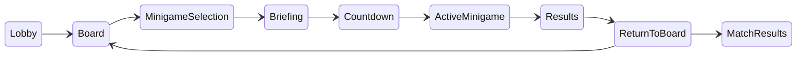
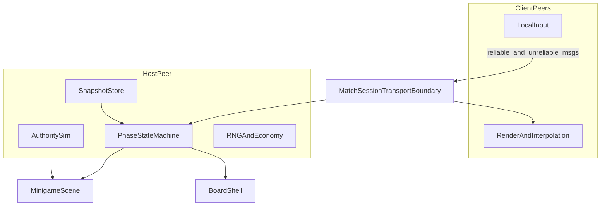
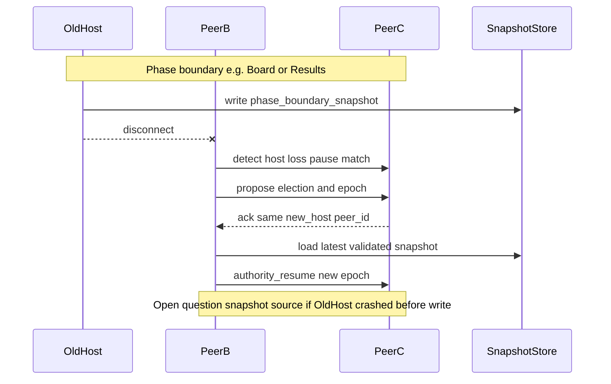

# Networking architecture

This guide describes the proposed online architecture for Bean Party. It is implementation guidance for a future networking spike, not production netcode. Class and API names are **proposals** until code lands.

Related documents:

- [Decision 0003: peer-hosted networking](decisions/0003-peer-hosted-networking.md) — chosen baseline and validation gates
- [Networking implementation plan](networking-implementation-plan.md) — milestones and test matrix
- [Minigame contribution contract](minigame-contract.md) — network-facing minigame inputs, outputs, and sync profiles

## Terminology

| Term | Meaning |
| --- | --- |
| **Network peer** | One connected machine or household (`peer_id` from Godot multiplayer) |
| **PlayerSlot** | Logical in-match player identity; stable across phases; may be local to one peer |
| **Host / authority** | The peer that owns canonical match state and validates client intentions |
| **Phase-boundary snapshot** | Serialized recoverable state stored only at safe match phases |
| **Session layer** | Proposed boundary between gameplay and the concrete `MultiplayerPeer` |
| **Sync profile** | Minigame-declared networking behavior: `TURN_OR_EVENT`, `HOST_SNAPSHOT`, `CUSTOM_APPROVED` |
| **match_epoch** | Proposed monotonic counter bumped when authority or snapshot generation changes |

### Status labels

- **Architectural direction** — recommended baseline to implement toward
- **Spike assumption** — default for the first ENet spike; may change after measurement
- **Open question** — must be answered by a milestone before treating behavior as final
- **Deferred** — intentionally out of the first networking vertical slice

## Match topology

**Architectural direction:** a match has exactly one **host peer** (authority) and zero or more **client peers**, with **up to 4 `PlayerSlot`s** total across all peers.

Proposed capacity constants:

| Constant | Value | Notes |
| --- | --- | --- |
| `MAX_PLAYERS` | 4 | Logical `PlayerSlot` hard cap |
| `MAX_PEERS` | TBD by spike | Bounded by ENet/Steam connection limits; likely ≤ 4 for friend sessions |

Example layouts:

- **4 remote friends** — 4 peers × 1 `PlayerSlot` each
- **Couch + online** — 2 peers × 2 local `PlayerSlot`s each
- **Local-only (no network)** — 1 peer × up to 4 `PlayerSlot`s (offline milestone 1)

```text
                    ┌──────────────── Host peer (authority) ────────────────┐
                    │  PlayerSlot A (local)   PlayerSlot B (local, couch) │
                    └───────────────┬─────────────────────────────────────┘
                                    │ reliable + unreliable messages
          ┌─────────────────────────┼─────────────────────────┐
          ▼                         ▼                         ▼
   Client peer 2              Client peer 3              Client peer 4
   PlayerSlot C               PlayerSlot D               PlayerSlot E, F
```

A **network peer** represents a connection endpoint. A **`PlayerSlot`** represents who is playing in the match. Multiple `PlayerSlot`s may share one `owning_peer_id` when one computer runs several local controllers.

### Proposed `PlayerSlot` schema

Documentation only—not a requirement to implement this GDScript class yet.

```text
player_id:            stable match-scoped ID (e.g. UUID)
owning_peer_id:       int — network peer that submits inputs for this slot
local_player_index:   int — stable 0..N-1 index for this slot on the owning peer (replicated)
display_name:         string
team_id:              optional int or string
character_id:         optional resource ID or cosmetic bundle ref
ready:                bool — briefing / lobby readiness
connection_status:    connected | disconnected | migrating | inactive
```

**Architectural direction:** `local_player_index` is the only couch identity replicated across the network. The mapping from `local_player_index` to physical controller/device (`local_device_slot`) stays **local to the owning peer** and is never replicated.

**Spike assumption:** `player_id` is assigned at lobby join and never reused within a match even if the player reconnects (reconnect binds to the same `player_id`).

## Authority boundaries

Exactly one network peer is authoritative at all times (**architectural direction**). There is no distributed consensus in v1.

### Host owns (authoritative)

| Domain | Examples |
| --- | --- |
| Canonical match state | Active phase, turn order, match timer |
| Board state | Positions, routes taken, tiles, items on board |
| Phase transitions | Lobby → board → minigame → results |
| RNG | Seeds and consequential random outcomes (minigame pick, board events) |
| Match economy | Beans, board resources, rewards applied to `PlayerSlot`s |
| Minigame lifecycle | Start tick/time, end time, forced teardown |
| Minigame simulation | Physics, hit detection, scoring logic (for network-capable minigames) |
| Results | Placements, score breakdown, board rewards |

### Clients may submit (non-authoritative intentions)

| Domain | Examples |
| --- | --- |
| Lobby / briefing | Ready toggles, cosmetic choices within allowed sets |
| Board | Move intent, route choice, spend-resource request |
| Minigame | Timestamped or tick-numbered input frames per local `PlayerSlot` |
| UI | Menu navigation that does not alter authoritative state |

### Clients must not authoritatively

- Assign themselves board positions, items, or economy
- Declare minigame wins, placements, or rewards
- Advance match phase
- Reseed RNG or override host simulation results
- Claim another peer's `PlayerSlot` or exceed `MAX_PLAYERS`

The host validates every client request. Malformed or conflicting requests are rejected; repeated abuse may mark the slot `inactive` (**open question:** kick/ban policy).

## Match phase state machine

**Architectural direction:** the shell drives a host-authoritative phase machine. Clients display phase UI and submit intentions; only the host commits transitions.

| Phase | Purpose |
| --- | --- |
| `Lobby` | Peers connect; `PlayerSlot`s assigned; match settings |
| `Board` | Turn-based or event-based board play |
| `MinigameSelection` | Host selects or RNG picks the next minigame |
| `Briefing` | Rules and ready gate |
| `Countdown` | Short synchronized start window |
| `ActiveMinigame` | Authoritative minigame simulation |
| `Results` | Placements, rewards presentation |
| `ReturnToBoard` | Apply rewards; decide match continuation |
| `MatchResults` | Final standings; return to menu or rematch |



All transitions are **host-authoritative**. Clients receive phase updates via reliable ordered messages.

### Phase-boundary snapshots

**Architectural direction:** snapshots are captured only at **safe phase boundaries** where interrupting and resuming is well defined.

| Capture after entering | Minimum snapshot contents |
| --- | --- |
| `Lobby` (match start) | All `PlayerSlot`s, settings, `match_epoch`, RNG seed |
| `Board` | Board layout, economy, turn state, `PlayerSlot` statuses |
| `Briefing` | Selected minigame id, teams, `PlayerSlot` readiness baseline |
| `Results` | Minigame outcome applied flag, pending board rewards |
| `ReturnToBoard` | Economy after reward application |
| `MatchResults` | Final scores (for rematch / stats) |

Each snapshot should include: `match_epoch`, phase name, RNG stream position, and a hash-friendly canonical serialization for automated consistency checks.

**Spike assumption:** the host writes snapshots; clients keep the last acknowledged copy for reconnect comparison.

**Open question:** snapshot schema versioning and migration across engine iterations.

Do **not** capture mid-`ActiveMinigame` snapshots for recovery in v1—in-round state is replayed from the last boundary by aborting the round (see disconnect policy).

## Message categories

Use Godot's [MultiplayerAPI](https://docs.godotengine.org/en/4.7/classes/class_multiplayerapi.html) RPC modes and channels. Exact RPC names are **proposals**; categories are **architectural direction**.

| Category | Delivery | Use for | Examples |
| --- | --- | --- | --- |
| **Reliable ordered** | `rpc` reliable | State whose **side effects** must not double-apply | Lobby ready, board move accepted, phase change, RNG outcome, minigame results, snapshot epoch |
| **Unreliable ordered state** | `rpc` unreliable | Frequent sim state; newer replaces older | Entity transforms, velocity, animation phase, periodic minigame state |
| **Unreliable cosmetic** | `rpc` unreliable, drop OK | Non-gameplay feedback | One-shot VFX/SFX triggers, emotes, non-scoring particles |

Representative mapping:

| Event | Category |
| --- | --- |
| Board action request (client → host) | Reliable ordered |
| Board action applied (host → all) | Reliable ordered |
| Readiness toggle | Reliable ordered |
| Input frame (client → host) | Unreliable ordered (re-send recent frames if needed) |
| Movement / physics snapshot (host → clients) | Unreliable ordered state |
| Scoring intermediate (host → clients) | Reliable ordered when it affects standings |
| Final results | Reliable ordered |
| Cosmetic bump sparkle | Unreliable cosmetic |

### Reliable side effects and idempotency

Godot reliable RPCs provide **at-most-once delivery** from the transport's perspective; duplicates or retries are still possible after reconnect or session churn. **Architectural direction:** the host must treat reliable messages that change state as idempotent using application-level keys:

| Idempotency key (proposal) | Used for |
| --- | --- |
| `command_id` | Client board/move requests, lobby actions |
| `minigame_instance_id` | One run of briefing → results for a selected minigame |
| `result_id` | Final minigame placement/score payload |
| `reward_application_id` | Board economy updates on `ReturnToBoard` |

The host keeps a bounded **processed-operation** set (or per-category high-water marks) and ignores duplicates. Tests should prove double-delivery does not double-apply rewards or results.

### Spike defaults (not permanent requirements)

| Parameter | Starting range to validate | Label |
| --- | --- | --- |
| Host simulation rate | 30 or 60 Hz depending on minigame | **Spike assumption** |
| State snapshots to clients | ~10–20 per second for `HOST_SNAPSHOT` minigames | **Spike assumption** |
| Local render rate | 60 Hz (decoupled from sim) | **Spike assumption** |
| Input send rate | Match local sampling up to sim rate | **Spike assumption** |

Measure and revise in milestones 7–8. Do not lock packet sizes or rates in this document.

## Real-time behavior

### Input pipeline (**architectural direction**)

1. Each owning peer samples local input per `PlayerSlot`, mapping `local_player_index` → physical controller **locally** on the owning machine.
2. Clients send **tick-numbered input frames** to the host on **unreliable ordered** channels, including a short **redundant history** (repeat the last few ticks) so packet loss does not wait on reliable retransmission.
3. Host validates inputs (allowed actions, player alive, phase correct).
4. Host advances authoritative simulation.
5. Host broadcasts state snapshots or deltas to clients.

### Remote entities (**architectural direction**)

- **Snapshot interpolation** is the required baseline for remote characters and props.
- Buffer 1–3 snapshots; interpolate between received states using receive time or tick.
- **Open question:** exact buffer size per minigame type.

### Local player (**spike assumption**)

- **Optional prediction** for the locally controlled entity: apply input immediately on the client, reconcile when host state arrives.
- Not all minigames must implement prediction; `TURN_OR_EVENT` minigames may wait for host acknowledgment.
- **Open question:** snap vs blend correction policy per sync profile.

### Minigame categories

| Style | Typical sync profile | Network notes |
| --- | --- | --- |
| Movement / physics | `HOST_SNAPSHOT` | Tick-numbered input upstream (unreliable + redundant history); snapshots downstream; interpolation required |
| Timing / button press | `TURN_OR_EVENT` | Tick-numbered press/hold frames (unreliable + redundant history); host adjudicates windows—**not** reliable per-button RPCs |
| Turn-based microgame | `TURN_OR_EVENT` | Host validates discrete actions; reliable messages only for phase/result side effects with idempotency keys |
| Latency-critical custom | `CUSTOM_APPROVED` | May add rollback; requires design review |

Short timing minigames may emphasize event timestamps and host adjudication rather than continuous transform sync.

## Transport boundary

**Architectural direction:** board and minigames do **not** create `ENetMultiplayerPeer` or Steam peers directly. A shared **session layer** establishes connections and exposes multiplayer state to the shell.

### Proposed responsibilities

| Component (proposal) | Owns |
| --- | --- |
| `TransportAdapter` | Create/bind `MultiplayerPeer`; swap ENet vs Steam implementation |
| `MatchSession` | Join codes / addresses; peer connect/disconnect events; maps `peer_id` ↔ connection metadata |
| Shell phase controller | Phase machine, snapshot store, host-only mutation APIs |

### Lifetime and ownership

**Architectural direction:** document ownership before adding a networking singleton.

- **Proposed:** `MatchSession` is owned by the app-level flow (e.g. match coordinator scene/controller), created when a player hosts or joins, torn down when returning to main menu.
- Minigames receive a read-only or capability-limited handle for sending inputs and receiving phase events—they do not own the peer.
- On teardown, minigames must unregister RPCs, disconnect signals, and clear buffered state ([minigame contract](minigame-contract.md)).

### First spike vs later Steam integration

| Transport | When | Label |
| --- | --- | --- |
| `ENetMultiplayerPeer` | Milestones 3–9 | **Spike assumption** |
| Steam Networking Sockets / SDR | Milestone 10 investigation | **Deferred** implementation |

**Open question:** whether candidate Godot Steam peer extensions support the same RPC channel layout as ENet. Milestone 10 must answer this before Steam is documented as a drop-in adapter.

### What not to do

- Do not use `MultiplayerSynchronizer` to blindly replicate entire minigame scenes as the default pattern. Authority boundaries are explicit; replication targets only host-approved state.
- Do not add third-party networking addons in the architecture spike without a decision record.



## Host migration and disconnect policy

Treat **two disconnect cases** separately.

| Case | Phases | Intended first-version behavior | Label |
| --- | --- | --- | --- |
| **A. Host loss during minigame** | `Countdown`, `ActiveMinigame` | Abort round; restore last phase-boundary snapshot; **replay** minigame | **Spike assumption** |
| **B. Host loss at phase boundary** | `Lobby`, `Board`, `MinigameSelection`, `Briefing`, `Results`, `ReturnToBoard`, `MatchResults` | End session cleanly; return peers to lobby | **Architectural direction** (v1) |

### First-version disconnect rules

| Rule | Behavior | Label |
| --- | --- | --- |
| Mid-minigame late join | Not supported | **Deferred** (spectator / rejoin-in-round) |
| Non-host disconnect | `PlayerSlot` → `inactive` (or `disconnected`); minigame may declare bot replacement | **Spike assumption** for inactive default |
| Reconnect | At phase boundaries only; restore from snapshot + `match_epoch` | **Architectural direction** |
| Host loss mid-minigame | Case A: abort + replay | **Spike assumption** |
| Host loss at phase boundary | End session cleanly | **Architectural direction** (v1) |
| Host migration (Case B continuity) | Remaining peers continue without re-hosting | **Deferred** (milestone 12) |
| Malformed client requests | Host rejects; no authority grant | **Architectural direction** |

### Host migration sub-problems (**deferred** — milestone 12)

Case B host migration is documented for future work and is **not** required to accept Decision 0003 or ship milestones 1–11.

1. **Detection and match pause** — disconnect vs heartbeat timeout; grace period for brief drops.
2. **Host election** — deterministic rule across remaining peers; cannot use `PlayerSlot` index alone when multiple slots share a peer.
3. **Snapshot handoff** — canonical blob on crash/Alt+F4.
4. **RPC continuity** — rebind `is_server()` caches; in-flight reliable RPC policy with idempotency keys.
5. **Player-facing continuity** — resync UI; preserve couch `local_player_index` → controller mapping locally on the owning peer.



### Failure modes to test

- Split-brain double host
- Stale snapshot restore after rewards visible
- RPCs targeting old `peer_id` after migration
- Exceeding 4 `PlayerSlot`s or claiming another peer's slot

See [networking implementation plan](networking-implementation-plan.md) for the disconnect recovery matrix and acceptance measurements.

## Player-count scale note

**Secondary open question:** whether peer-hosted `HOST_SNAPSHOT` sync remains acceptable at 4 players without interest management or per-tick aggregation. Measure in milestones 7 and 10.
